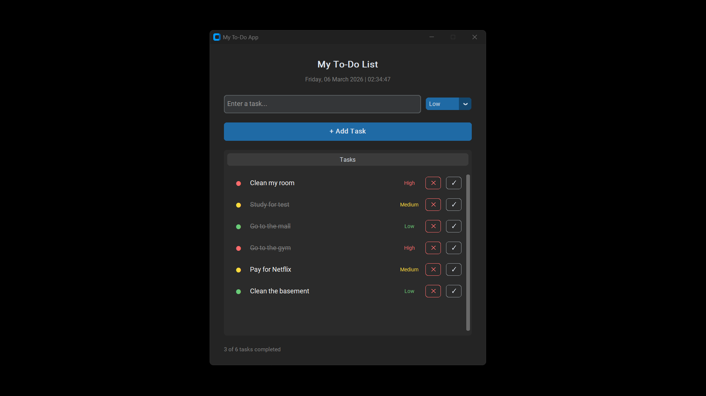

# My To-Do App

A clean, modern desktop to-do application built with Python and CustomTkinter.



## Features

- Add tasks with priority levels — High, Medium, or Low
- Colour-coded priority indicators so you can see what matters at a glance
- Mark tasks as complete with a single click
- Delete tasks you no longer need
- Progress bar tracking how many tasks you've completed
- Live clock display
- Tasks are saved automatically — your list persists when you close and reopen the app

## Tech Stack

- Python 3
- CustomTkinter — for the modern dark UI
- JSON — for local task persistence

## How to Run

**Run from source:**

1. Clone the repo
2. Install dependencies:
   ```bash
   pip install customtkinter
   ```
3. Run the app:
   ```bash
   python main.py
   ```

## What I Learned

- Building desktop GUIs with CustomTkinter
- Structuring event-driven Python applications
- Persisting data locally using JSON file storage
- Packaging a Python app into a standalone executable with PyInstaller

## Author

**Omobolanle Sadela**  
[GitHub](https://github.com/bolanlesadela) · [LinkedIn](https://www.linkedin.com/in/omobolanle-sadela-7a486a1b4/)
